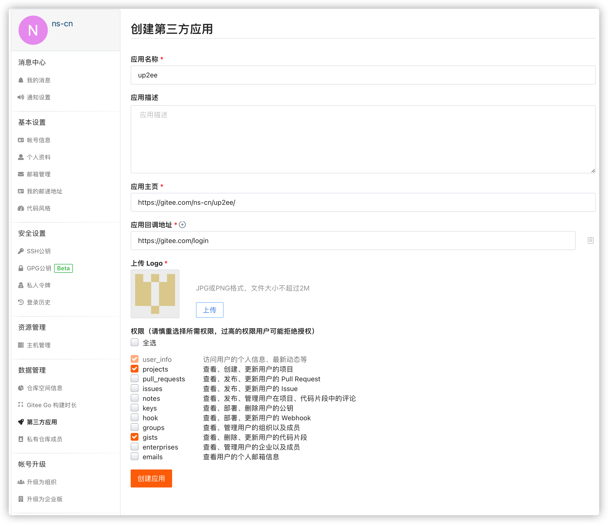
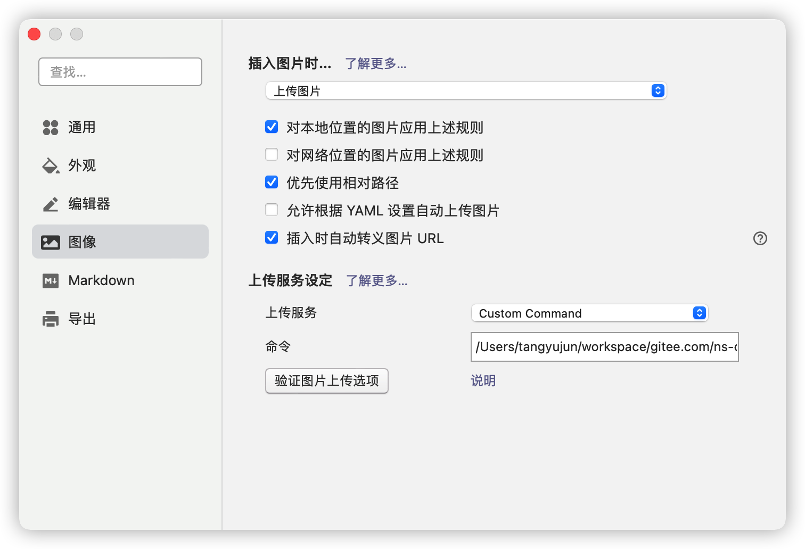

# up2ee

## 一、介绍

图床命令软件,上传图片到gitee并返回对应的文件名称列表

## 二、安装教程

### 手动安装

      [下载地址](https://github.com/ns-cn/up2ee/releases),可选win、linux、mac操作系统

### homebrew安装

```Shell
   brew tap ns-cn/ttools
   brew install up2ee
```

## 三、使用

### gitee后台配置

   由于通过三方接入gitee需要在gitee后台创建三方应用并获取对应的`ClientId`和`ClientSecret`

   其中应用名称和应用主页及回调地址可参考如下地址填写，logo可随意选择图片，但其中权限必须勾选至少`projects`和`gists`两个权限

   

### typora软件配置

   在typora中按照如下设置设置`上传图片`，并在上传设置中选择`custom command`

   其中命令格式如下：

```Shell
【命令全路径】 -c 【ClientId】 -s 【ClientSecret】 -u 【gitee用户名】 -p 【gitee密码】 
```

> 如果通过homebrew或配置环境变量，可使用`up2ee`代替命令全路径

例如

```shell
up2ee -u ns-cn -p p@ssw0rd -c 052f6*****************************eb40cbd63b -s 052f6*****************************eb40cbd63b
```

如果不希望使用默认的`up2ee-data`仓库名称，可使用`-r`或则`--repository`参数指定仓库名称



## 四、命令简介

```shell
upload to gitee

Usage:
  up2ee [flags]

Flags:
  -c, --clientid string       ClientId,通过gitee后台创建生成
  -s, --clientsecret string   ClientSecret,通过gitee后台创建生成
  -h, --help                  help for up2ee
  -r, --repository string     仓库,optional (default "up2ee-data")
  -t, --testaccess            测试认证(仅认证,不做任何操作)
  -u, --username string       用户名
  -p, --userpassword string   用户密码
```

## 五、后续计划

- [ ] 自动管理并选择仓库（配置可选）
- [ ] 自动对图片进行压缩（配置可选）
